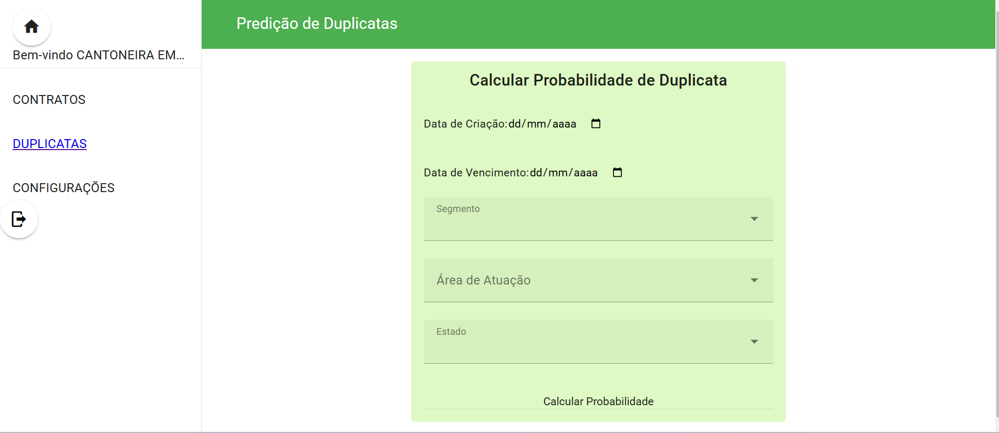
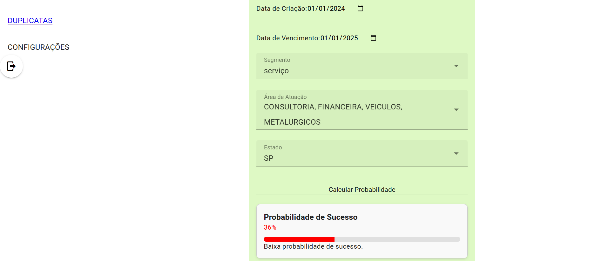
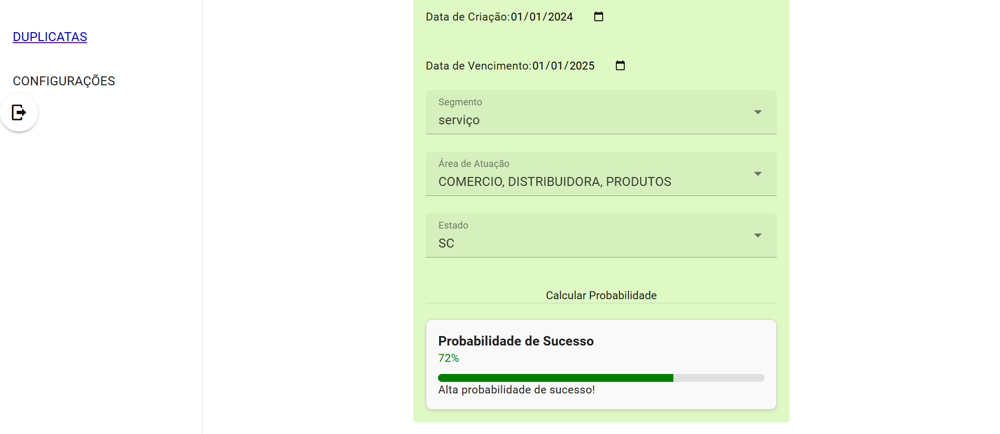
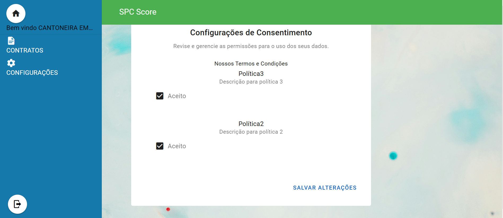

# API 6th Semester - Quarks Team

### [PT/BR README:](https://github.com/quarks-team/Projeto-Integrador-SPCGrafeno/blob/main/Documents/PTBR/README_PT.md)

 

## Repository Overview

This repository contains the manual and other resources related to the 2024-2 Integrador Project.

### Context

We have been engaged by SPC Grafeno, a financial asset register, to develop innovative financial products leveraging machine learning techniques. The company has provided us with a diverse dataset containing historical information on various financial assets, transactions, and market behaviors.

### Challenge

Our challenge is to explore this extensive database, identify patterns and opportunities, and create one or more financial products that provide value to both SPC Grafeno and its clients.

We are expected to employ machine learning techniques to:

- Predict market trends
- Identify risks
- Propose methods for asset evaluation

The solution should culminate in a proof of concept that demonstrates the feasibility of the proposed product. This will include:

- A detailed description of the model used
- Justification for the selected techniques
- A performance evaluation of the model

At the end of the project, we will present our findings in a report, complemented by a presentation that clearly outlines how our solution can be utilized by SPC Grafeno and the benefits it can offer to the registry and its clients.

### Proposed Solution

We propose developing a system that analyzes the reliability of endorsers using AI algorithms and models. This system will generate a score that reflects how well a company upholds its credit commitments. Given that possessing an invoice typically guarantees that the amount contracted in advance will be paid, our solution aims to enhance the evaluation process for both the company and its clients.

## Requirements

### Functional Requirements

1. **AI Score Generation**: Develop an AI system that generates a credit score based on the endorser's historical data.
2. **Web Platform**: Create a web platform that displays the score for endorser users and their historical data.
3. **Consent Mechanism**: Implement a consent mechanism where users can agree to or revoke the use of their data in accordance with LGPD.
4. **Duplicate Completion Prediction**: Utilize AI to predict the probability of a contract being finalized based on user data, allowing data scientists to test various algorithms for reliability in fulfilling credit obligations.
5. **Real-Time Score Feedback**: Enable clients to input their data and see how it impacts their score in real time.
6. **Target Score Adjustment**: Provide a mechanism for clients to enter a target score and receive suggestions on what changes are needed to achieve it, including an interface for endorser users to discover necessary adjustments.
7. **Variable Impact Insights**: Allow users to see which variables are influencing their credit score and the level of their impact, fostering informed decision-making.

### Non-Functional Requirements

1. **Compliance**: Ensure the system complies with the General Data Protection Law (LGPD).
2. **Security**: Implement secure authentication and authorization processes to protect user data, particularly ensuring endorser users can only access their own information.
3. **Usability**: Design an intuitive user interface for the web platform that facilitates easy navigation and data access for both endorser and SPC users.
4. **Performance**: Optimize the AI models to provide timely responses for real-time feedback, ensuring quick data processing and delivery.
5. **Scalability**: Design the system to handle increased loads as the number of users grows, ensuring performance remains stable under higher usage.
6. **Documentation**: Provide comprehensive documentation for both users and developers, including details on consent configurations, privacy policies, and API usage.

<h2>Backlog of User Stories</h2>

<table>
  <tr>
    <th>ID</th>
    <th>Story</th>
    <th>Description</th>
    <th>Priority</th>
    <th>Requirements Met</th>
  </tr>
  <tr>
    <td>1</td>
    <td><a href="https://github.com/quarks-team/Projeto-Integrador-SPCGrafeno/blob/main/Documents/userStorys/ENUs/dashboardAnaliseCnpjsScore.md" target="_blank">Dashboard for duplicate market analysis</a></td>
    <td>Develop a dashboard for analyzing duplicate market data</td>
    <td>High</td>
    <td>Duplicate Completion Prediction</td>
  </tr>
  <tr>
    <td>2</td>
    <td><a href="https://github.com/quarks-team/Projeto-Integrador-SPCGrafeno/blob/main/Documents/userStorys/ENUs/ModeloIAVisandoScore.md" target="_blank">AI model for Score</a></td>
    <td>Create an AI model to generate user scores</td>
    <td>High</td>
    <td>AI Score Generation, Documentation</td>
  </tr>
  <tr>
    <td>3</td>
    <td><a href="https://github.com/quarks-team/Projeto-Integrador-SPCGrafeno/blob/main/Documents/userStorys/ENUs/loginAutenticacaoEndorser.md" target="_blank">Login/Authentication for Endorser</a></td>
    <td>Implement login and authentication for endorser users</td>
    <td>High</td>
    <td>Web Platform, Usability, Compliance</td>
  </tr>
  <tr>
    <td>4</td>
    <td><a href="https://github.com/quarks-team/Projeto-Integrador-SPCGrafeno/blob/main/Documents/userStorys/ENUs/transformacaoDosDadosParaIA.md" target="_blank">Data Transformation for AI</a></td>
    <td>Perform data transformation for AI model usage</td>
    <td>High</td>
    <td>Performance, Security, AI Score Generation, Documentation</td>
  </tr>
  <tr>
    <td>5</td>
    <td><a href="https://github.com/quarks-team/Projeto-Integrador-SPCGrafeno/blob/main/Documents/userStorys/ENUs/PrevisaoDeFinalizacaoDeDuplicatasSPC.md" target="_blank">Duplicate Completion Prediction - SPC</a></td>
    <td>Use AI to predict the completion of duplicate contracts</td>
    <td>High</td>
    <td>Duplicate Completion Prediction, Documentation</td>
  </tr>
  <tr>
    <td>7</td>
    <td><a href="https://github.com/quarks-team/Projeto-Integrador-SPCGrafeno/blob/main/Documents/userStorys/ENUs/AcessoHistoricoDuplicatasSPC.md" target="_blank">Access to Duplicate History - SPC</a></td>
    <td>Enable access to duplicate history for SPC users</td>
    <td>Medium</td>
    <td>Duplicate Completion Prediction, Usability</td>
  </tr>
    <tr>
    <td>8</td>
    <td><a href="https://github.com/quarks-team/Projeto-Integrador-SPCGrafeno/blob/main/Documents/userStorys/ENUs/ConsentConfiguration.md" target="_blank">Security Requirements Based on LGPD</a></td>
    <td>Set up consent mechanisms for endorsers</td>
    <td>High</td>
    <td>Security, Compliance, Consent Mechanism, Usability </td>
  </tr>
  <tr>
    <td>9</td>
    <td><a href="https://github.com/quarks-team/Projeto-Integrador-SPCGrafeno/blob/main/Documents/userStorys/ENUs/previsaoScoreAlvoEndorser.md" target="_blank">Target Score Prediction/Recommendation - Endorser</a></td>
    <td>Provide recommendations to reach a target score</td>
    <td>High</td>
    <td>Web Platform, Target Score Adjustment, Usability</td>
  </tr>
  <tr>
    <td>10</td>
    <td><a href="https://github.com/quarks-team/Projeto-Integrador-SPCGrafeno/blob/main/Documents/userStorys/ENUs/DuplicataSeriesPrediction.md" target="_blank">AI to Predict Duplicate/Series Outcomes</a></td>
    <td>AI for predicting duplicates and time series outcomes</td>
    <td>High</td>
    <td>Duplicate Completion Prediction</td>
  </tr>
</table>

<table>
  <tr>
    <th>ID</th>
    <th>Story</th>
    <th>Description</th>
    <th>Priority</th>
    <th> Requirements Met</th>
  </tr>
  <tr>
    <td>1</td>
    <td><a href="https://github.com/quarks-team/Projeto-Integrador-SPCGrafeno/blob/main/Documents/userStorys/ENUs/PipelineDeCIBackend.md" target="_blank">Backend CI Pipeline</a></td>
    <td>Set up CI pipeline for the backend</td>
    <td>High</td>
    <td>Scalability</td>
  </tr>
  <tr>
    <td>2</td>
    <td><a href="https://github.com/quarks-team/Projeto-Integrador-SPCGrafeno/blob/main/Documents/userStorys/ENUs/CIPipelineForFrontend.md" target="_blank">Frontend CI Pipeline</a></td>
    <td>Set up CI pipeline for the frontend</td>
    <td>High</td>
    <td>Scalability</td>
  </tr>
  <tr>
    <td>3</td>
    <td><a href="https://github.com/quarks-team/Projeto-Integrador-SPCGrafeno/blob/main/Documents/userStorys/ENUs/OtimizacaodeModelosIA.md" target="_blank">AI Model Optimization</a></td>
    <td>Optimize AI models for better performance</td>
    <td>High</td>
    <td>Scalability, Performance </td>
  </tr>
</table>

## Sprint 1 Detailed Objective

**Objective:**  
To develop and implement the foundational components of the AI model that generates credit scores based on CNPJ data, enabling users to effectively access and analyze their credit score values. This sprint aims to achieve the following specific goals:

1. **AI Model Development:**
   - Research and select multiple AI algorithms suitable for credit scoring based on CNPJ data.
   - Develop and test initial versions of the AI models to generate credit scores, ensuring that they accurately reflect the user's creditworthiness and commitment.

2. **User Access and Experience:**
   - Implement a secure and user-friendly login functionality for CNPJ users on the web platform, allowing them to authenticate and access their individual credit scores.
   - Design an intuitive interface that displays the user's credit score alongside relevant historical data, enhancing the user experience and promoting informed decision-making.

3. **Data Transformation and Storage:**
   - Clean and preprocess the necessary data to ensure its quality and reliability for AI model testing.
   - Transform and store this data in the database, making it accessible for the AI model, while also maintaining data integrity and compliance with relevant regulations.

4. **Testing and Validation:**
   - Conduct thorough testing of both the AI models and the web platform functionalities to identify and resolve any issues before deployment.
   - Gather user feedback during testing to refine the AI scoring process and the user interface, ensuring alignment with user expectations and requirements.

5. **Documentation and Knowledge Transfer:**
   - Document the processes, algorithms, and methodologies used in developing the AI model for future reference and scalability.
   - Prepare training materials and sessions for team members and stakeholders to facilitate understanding and support for the new features introduced in this sprint.

By the end of Sprint 1, users should be able to log in to the web platform, view their credit scores generated by the AI model, and access historical data relevant to their credit endorsements, paving the way for more advanced analytics and insights in subsequent sprints.

## Backlog Sprint 1

<table border="1">
    <thead>
        <tr>
            <th>ID</th>
            <th>Story</th>
            <th>Description</th>
            <th>Priority</th>
            <th>Requirements Met</th>
        </tr>
    </thead>
    <tbody>
        <tr>
    <td>3</td>
    <td><a href="https://github.com/quarks-team/Projeto-Integrador-SPCGrafeno/blob/main/Documents/userStorys/ENUs/loginAutenticacaoEndorser.md" target="_blank">Login/Authentication for Endorser</a></td>
    <td>Implement login and authentication for endorser users</td>
    <td>High</td>
    <td>Web Platform, Usability, Compliance</td>
  </tr>
        <tr>
    <td>2</td>
    <td><a href="https://github.com/quarks-team/Projeto-Integrador-SPCGrafeno/blob/main/Documents/userStorys/ENUs/ModeloIAVisandoScore.md" target="_blank">AI model for Score</a></td>
    <td>Create an AI model to generate user scores</td>
    <td>High</td>
    <td>AI Score Generation, Documentation</td>
  </tr>
        <tr>
    <td>4</td>
    <td><a href="https://github.com/quarks-team/Projeto-Integrador-SPCGrafeno/blob/main/Documents/userStorys/ENUs/transformacaoDosDadosParaIA.md" target="_blank">Data Transformation for AI</a></td>
    <td>Perform data transformation for AI model usage</td>
    <td>High</td>
    <td>Performance, Security, AI Score Generation, Documentation</td>
  </tr>
        <tr>
    <td>8</td>
    <td><a href="https://github.com/quarks-team/Projeto-Integrador-SPCGrafeno/blob/main/Documents/userStorys/ENUs/ConsentConfiguration.md" target="_blank">Security Requirements Based on LGPD</a></td>
    <td>Set up consent mechanisms for endorsers</td>
    <td>High</td>
    <td>Security, Compliance, Consent Mechanism, Usability </td>
  </tr>
    </tbody>
</table>

## Wireframe Sprint 1

    
Show Wireframes

        <h2>Login Page</h2>
        
        <h2>Home Page</h2>
        
        <h2>Bills Table Page</h2>
        

<h3><a href = "https://github.com/quarks-team/Projeto-Integrador-SPCGrafeno/blob/main/Documents/README.md" target='_blank'> Tutorial to build application: </a></h3

## Final App Sprint 1

    
Show Application

    <h2>Login Endorser Medium Score</h2>
    
    <h2>Login Endorser Low Score</h2>
    

## Sprint 2 Objective

This sprint aims to develop AI-based solutions to predict the finalization of duplicates. Additionally, it will focus on implementing a consent mechanism in compliance with the LGPD and improving the AI score model.

### Key Goals

- **Duplicate Finalization Prediction:** Create an AI model to analyze user inputs and predict whether a duplicate will be finalized, enabling informed decision-making.

- **Improvement of AI Score Model:** Enhance the existing AI score model to increase accuracy and reliability in predicting user credit scores.

- **Completion of LGPD-Compliant Consent Mechanism:** Finalize the consent system to give users clear control over their personal data and ensure legal compliance.

### Expected Impact

Effective predictions will enable users to make informed financial decisions, enhancing asset management. The consent mechanism will ensure legal compliance and build user trust in the platform.

### Sprint Outcome

At the end of the sprint, we expect to deliver a functional AI model, an intuitive user interface for duplicate predictions, and a robust consent system fully compliant with legal requirements.

## Sprint 2 Backlog

### Functional Requirements

<table border="1">
  <thead>
    <tr>
      <th>ID</th>
      <th>Story</th>
      <th>Description</th>
      <th>Priority</th>
      <th>Requirements Met</th>
    </tr>
  </thead>
  <tbody>
    <tr>
    <td>1</td>
    <td><a href="https://github.com/quarks-team/Projeto-Integrador-SPCGrafeno/blob/main/Documents/userStorys/ENUs/dashboardAnaliseCnpjsScore.md" target="_blank">Dashboard for duplicate market analysis</a></td>
    <td>Develop a dashboard for analyzing duplicate market data</td>
    <td>High</td>
    <td>Duplicate Completion Prediction</td>
  </tr>
    <tr>
    <td>2</td>
    <td><a href="https://github.com/quarks-team/Projeto-Integrador-SPCGrafeno/blob/main/Documents/userStorys/ENUs/CIPipelineForFrontend.md" target="_blank">Frontend CI Pipeline</a></td>
    <td>Set up CI pipeline for the frontend</td>
    <td>High</td>
    <td>Scalability</td>
  </tr>
    <tr>
    <td>4</td>
    <td><a href="https://github.com/quarks-team/Projeto-Integrador-SPCGrafeno/blob/main/Documents/userStorys/ENUs/transformacaoDosDadosParaIA.md" target="_blank">Data Transformation for AI</a></td>
    <td>Perform data transformation for AI model usage</td>
    <td>High</td>
    <td>Performance, Security, AI Score Generation, Documentation</td>
  </tr>
    <tr>
    <td>2</td>
    <td><a href="https://github.com/quarks-team/Projeto-Integrador-SPCGrafeno/blob/main/Documents/userStorys/ENUs/ModeloIAVisandoScore.md" target="_blank">AI model for Score</a></td>
    <td>Create an AI model to generate user scores</td>
    <td>High</td>
    <td>AI Score Generation, Documentation</td>
  <tr>
    <td>5</td>
    <td><a href="https://github.com/quarks-team/Projeto-Integrador-SPCGrafeno/blob/main/Documents/userStorys/ENUs/PrevisaoDeFinalizacaoDeDuplicatasSPC.md" target="_blank">Duplicate Completion Prediction - SPC</a></td>
    <td>Use AI to predict the completion of duplicate contracts</td>
    <td>High</td>
    <td>Duplicate Completion Prediction, Documentation</td>
  </tr>
      <tr>
    <td>3</td>
    <td><a href="https://github.com/quarks-team/Projeto-Integrador-SPCGrafeno/blob/main/Documents/userStorys/ENUs/OtimizacaodeModelosIA.md" target="_blank">AI Model Optimization</a></td>
    <td>Optimize AI models for better performance</td>
    <td>High</td>
    <td>Scalability, Performance </td>
  </tr>
  </tbody>
</table>

<table border="1">
  <thead>
    <tr>
      <th>ID</th>
      <th>Story</th>
      <th>Description</th>
      <th>Priority</th>
      <th>Non-Functional Requirements Met</th>
    </tr>
  </thead>
  <tbody>
    <tr>
    <td>1</td>
    <td><a href="https://github.com/quarks-team/Projeto-Integrador-SPCGrafeno/blob/main/Documents/userStorys/ENUs/PipelineDeCIBackend.md" target="_blank">Backend CI Pipeline</a></td>
    <td>Set up CI pipeline for the backend</td>
    <td>High</td>
    <td>Scalability</td>
  </tr>
    <tr>
    <td>2</td>
    <td><a href="https://github.com/quarks-team/Projeto-Integrador-SPCGrafeno/blob/main/Documents/userStorys/ENUs/CIPipelineForFrontend.md" target="_blank">Frontend CI Pipeline</a></td>
    <td>Set up CI pipeline for the frontend</td>
    <td>High</td>
    <td>Scalability</td>
  </tr>
  </tbody>
</table>

    
Finalization probability page

    <h2>Blank</h2>
    
    <h2>Probability low</h2>
    
    <h2>Probability high</h2>
    

    
Consent configuration page

    

## Url to access the backend

ip4-recivables-production.up.railway.app

## Url to access the swagger of the backend app

ip4-recivables-production.up.railway.app/api

## Sprint 3 Objective

This sprint focuses on delivering enhancements in AI-based user recommendations, advanced duplicate behavior prediction, and improvements to the consent mechanism infrastructure. The aim is to improve user engagement, predictive accuracy, and ensure comprehensive compliance with consent management practices.

### Key Goals

- **User Recommendation System**: Develop an AI-powered recommendation system that guides users on the most relevant score-influencing variables and the level of impact each has on their overall score.

- **Duplicate Behavior Forecasting AI**: Implement an AI model to forecast duplicate behavior across different groupings, including the entire dataset, individual client segments, and AI-generated clusters or score ranges. This will help users and stakeholders understand market trends and make data-driven decisions.

- **Consent History and Versioning Structure**:
  - Implement a complete consent acceptance history in MongoDB, recording the date and version of the terms accepted by users.
  - Update the database structure to include the new terminology, changing "policy" to "term".
  - Ensure versioning updates for terms whenever a new version is released.
  - Remove the current `userPolicies` table to simplify the structure.
  - Introduce transparency regarding data usage and a mechanism for data deletion if consent is revoked.

### Expected Impact

The AI recommendation system will empower users by highlighting which score-related variables to prioritize, enhancing their decision-making process. The duplicate behavior forecasting model will offer insights into market dynamics and segmented behavior, supporting strategic planning. The revamped consent mechanism will bolster legal compliance, maintain a transparent record of user consent, and build trust by ensuring data control and deletion capabilities.

### Sprint Outcome Objectives

By the end of this sprint, we aim to achieve the following:

1. **User-Focused AI Recommendation System**:
   - **Objective**: Develop an AI-based recommendation system that provides users with clear insights into how various variables impact their credit scores.
   - **Details**: The system will show which factors have the most influence on the user's score and suggest actionable changes they can implement to improve their scores. This feature will leverage a classification AI model for precise and user-friendly feedback.

2. **Robust Duplicate Behavior Prediction Model**:
   - **Objective**: Implement a model to predict behavior trends for groups of duplicates instead of focusing solely on individual duplicates.
   - **Details**: The model will analyze data divided into cohorts to predict tendencies, such as whether duplicates are likely to be finalized, canceled, or exhibit specific due date aging patterns. This will be achieved using temporal series analysis and AI designed for cohort analysis.

3. **Fully Implemented Consent History and Versioning Structure**:
   - **Objective**: Complete the integration of a consent history and versioning structure in **MongoDB**.
   - **Details**: This will ensure comprehensive tracking of user consent, including changes in consent status over time, supporting regulatory compliance and improving user transparency.

4. **Enhanced User Transparency and Data Management Features**:
   - **Objective**: Provide users with better access and understanding of how their data is used and managed.
   - **Details**: Implement features that bolster user transparency, ensuring users can view and manage their data effectively while understanding the implications of various data policies.

These objectives are structured to deliver tangible improvements in user experience, data analysis capabilities, and compliance with data management best practices.

## Sprint 3 Backlog

<table border="1">
    <thead>
        <tr>
            <th>ID</th>
            <th>Story</th>
            <th>Description</th>
            <th>Priority</th>
            <th>Requirements Met</th>
        </tr>
    </thead>
    <tbody>
        <tr>
    <td>5</td>
    <td><a href="https://github.com/quarks-team/Projeto-Integrador-SPCGrafeno/blob/main/Documents/userStorys/ENUs/PrevisaoDeFinalizacaoDeDuplicatasSPC.md" target="_blank">Duplicate Completion Prediction - SPC</a></td>
    <td>Use AI to predict the completion of duplicate contracts</td>
    <td>High</td>
    <td>Duplicate Completion Prediction, Documentation</td>
  </tr>
        <tr>
    <td>8</td>
    <td><a href="https://github.com/quarks-team/Projeto-Integrador-SPCGrafeno/blob/main/Documents/userStorys/ENUs/ConsentConfiguration.md" target="_blank">Security Requirements Based on LGPD</a></td>
    <td>Set up consent mechanisms for endorsers</td>
    <td>High</td>
    <td>Security, Compliance, Consent Mechanism, Usability </td>
  </tr>
        <tr>
    <td>9</td>
    <td><a href="https://github.com/quarks-team/Projeto-Integrador-SPCGrafeno/blob/main/Documents/userStorys/ENUs/previsaoScoreAlvoEndorser.md" target="_blank">Target Score Prediction/Recommendation - Endorser</a></td>
    <td>Provide recommendations to reach a target score</td>
    <td>High</td>
    <td>Web Platform, Target Score Adjustment, Usability</td>
  </tr>
        <tr>
    <td>10</td>
    <td><a href="https://github.com/quarks-team/Projeto-Integrador-SPCGrafeno/blob/main/Documents/userStorys/ENUs/DuplicataSeriesPrediction.md" target="_blank">AI to Predict Duplicate/Series Outcomes</a></td>
    <td>AI for predicting duplicates and time series outcomes</td>
    <td>High</td>
    <td>Duplicate Completion Prediction</td>
  </tr>
    </tbody>
</table>

<h3>Non-Functional</h3>
<table border="1">
    <thead>
        <tr>
            <th>ID</th>
            <th>Story</th>
            <th>Description</th>
            <th>Priority</th>
            <th> Requirements Met</th>
        </tr>
    </thead>
    <tbody>
        <tr>
    <td>3</td>
    <td><a href="https://github.com/quarks-team/Projeto-Integrador-SPCGrafeno/blob/main/Documents/userStorys/ENUs/OtimizacaodeModelosIA.md" target="_blank">AI Model Optimization</a></td>
    <td>Optimize AI models for better performance</td>
    <td>High</td>
    <td>Scalability, Performance </td>
  </tr>
    </tbody>
</table>

# Sprint 3 new features:

    
Show Application

    <h2>Prediction for finished duplicates using Temporal Series:</h2>
    
    <h2>Recomendations to increase score using Random Forest :</h2>
    <h3> TO DO....</h3>

### Used Technologies

- [Typescript](https://www.typescriptlang.org/)
- [Node.js](https://nodejs.org/en)
- [PostgreSql](https://https://www.postgresql.org/)
- [Vue.js](https://vuejs.org/)
- [Python](https://www.python.org/)
- [Railway](https://railway.app/)
- [Docker/Docker Compose](https://www.docker.com/)
  
  

## Schedule

| Event             | Date           |
| ----------------- | -------------- |
| Kick-off          | 02/09 to 08/09 |
| Sprint 1          | 09/09 to 29/09 |
| Review            | 30/09 to 04/10 |
| Sprint 2          | 07/10 to 27/10 |
| Review            | 28/10 to 01/11 |
| Sprint 3          | 04/11 to 24/11 |
| Review            | 25/11 to 11/12 |
| Feira de Soluções | 12/12          |

(<a href="#top">Scroll to top</a>)

## Team

| Avatar                                                     | Student               | Function         | GitHub                                                              | LinkedIn                                                                           |
| ---------------------------------------------------------- | --------------------- | ---------------- | ---------------------------------------------------------------------- | --------------------------------------------------------------------------------- |
|     | **Daniela Meirelles** | _Scrum Master_ |      | 
|    | **Leonardo Adler**    | _Product Owner_ |            | 
|      | **Felipe Augusto**    | _Developer Team_   |      | 
|     | **Gabriel Timoteo**   | _Developer Team_  |  | 
|  | **Guilherme Alves**   | _Developer Team_ |       | |
|       | **Lucas Barcelos**    | _Developer Team_ |      | 
|    | **Nicolas Cursino**   | _Developer Team_ |           | 

(<a href="#top">Scroll to top</a>)

## Documentation

- [Commit Pattern](https://github.com/quarks-team/Projeto-Integrador-SPCGrafeno/wiki/Commit-Pattern)
- [Documentation of Consent Processes](https://github.com/quarks-team/Projeto-Integrador-SPCGrafeno/wiki/Documentation-of-Consent-Processes)
- [Weight Rules for the AI Score](https://github.com/quarks-team/Projeto-Integrador-SPCGrafeno/wiki/AI-Score-Weight-Rules-Documentation)

## License

This project was created under the MIT license - look the file [LICENSE](LICENSE) for more details.
