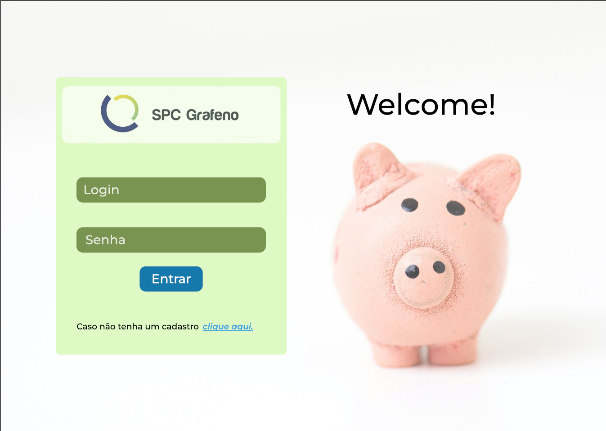
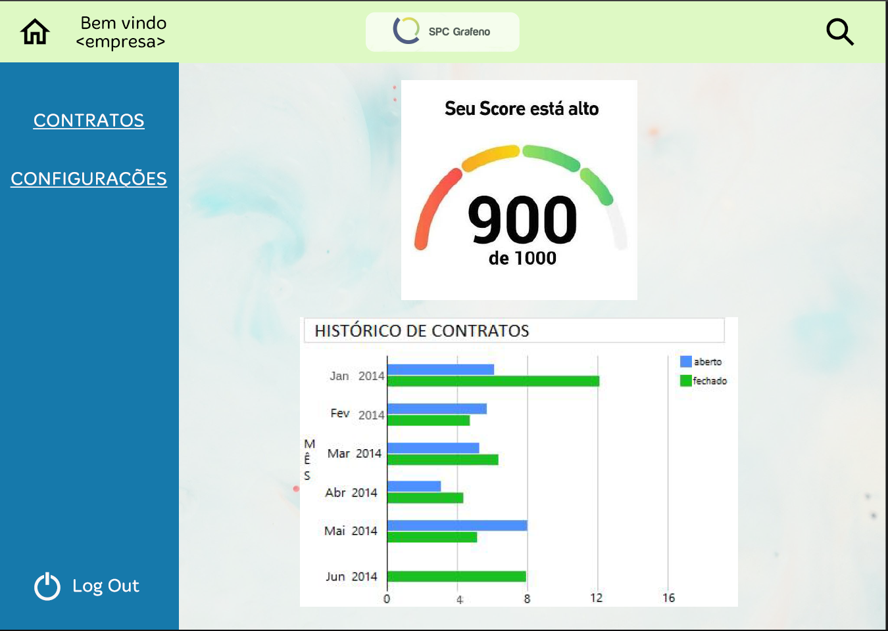

# API 6th Semester - Quarks Team
 

## Repository containing the manual and other repositories of the 2024-2 integrator project.

# Context

We have been hired by a financial asset register(SPC Grafeno) to create new, innovative financial products using machine learning techniques. The company provided a diverse database containing historical information on a variety of financial assets, transactions, and market behaviors.

# Challenge

The challenge is to explore this database, identify patterns and opportunities, and develop one or more financial products that can add value to both the company and its clients.

We are expected to use machine learning techniques to predict trends, identify risks, or even propose methods for evaluating assets. Our solution should be implemented in a proof of concept that demonstrates the feasibility of the proposed product, including a description of the model used, justification for the choice of techniques employed, and a performance evaluation of the model.

In the end, we will need to present your results in a report, along with a presentation that clearly and objectively explains how your solution can be used by the company and what benefits it can bring to the registry and its clients.

## Proposed Solution:
A system that analyzes the reliability of an endorser through AI algorithms/models that can generate a score demonstrating how well a Company maintains its commitment to credit. Since merely having a invoice is practically a guarantee that the amount contracted in the advance will be paid.

## Requirements
<table border="1" cellpadding="10" cellspacing="0">
  <thead>
    <tr>
      <th>Category</th>
      <th>Requirement</th>
      <th>Description</th>
      <th>Source (User Story)</th>
    </tr>
  </thead>
  <tbody>
    <!-- Functional Requirements -->
    <tr>
      <td rowspan="9">Functional</td>
      <td>Terms of Use Consent Management Interface</td>
      <td>Create a user interface where the CNPJ/endorser can update their consent status for data usage, with the option to revoke or partially revoke access, explaining the impact of these actions.</td>
      <td> Consent management interface</td>
    </tr>
    <tr>
      <td>API for Consent Status Updates</td>
      <td>Develop APIs that update and track user consent changes, ensuring data is properly updated in the backend.</td>
      <td>APIs for consent status updates</td>
    </tr>
    <tr>
      <td>Log Changes in Consent</td>
      <td>Create a log table to track all changes to user consent status, including acceptance and revocation history, and track the version of terms accepted.</td>
      <td>Register/Logs of consent changes</td>
    </tr>
    <tr>
      <td>AI Data DDL</td>
      <td>Create a DDL for AI data, including input data from CSV files and a table to store AI-generated scores for each CNPJ.</td>
      <td>DDL for the IA data</td>
    </tr>
    <tr>
      <td>Complete AI Data ETL</td>
      <td>Perform a complete ETL process based on the generated DDL, removing unnecessary data, standardizing fields, and converting data types where necessary.</td>
      <td>Complete ETL for data used by the IA model</td>
    </tr>
    <tr>
      <td>AI Model for Endorser Score Calculation</td>
      <td>Create the final AI model for calculating endorser scores, following best practices such as using 60% of the dataset for training and 20% for testing, ensuring proper training and no overfitting.</td>
      <td>Creation of the model to calculate score for endossers</td>
    </tr>
    <tr>
      <td>Score Display Screen</td>
      <td>Develop a screen that displays the logged-in user's CNPJ score, sourced from the AI results table.</td>
      <td> View to analyse and visualize the score from the logged user</td>
    </tr>
    <tr>
      <td>API for Score Retrieval</td>
      <td>Create an API that retrieves the score for the logged-in user's CNPJ, ensuring proper authentication and data filtering.</td>
      <td>Api for search and return from the score of the users</td>
    </tr>
    <tr>
      <td>Documentation for AI Usage</td>
      <td>Create documentation explaining how clients or users should utilize the AI model for score analysis, detailing the data flow and model usage.</td>
      <td>Docs for the IA Model</td>
    </tr>
    <tr>
      <td rowspan="4">Non-Functional</td>
      <td>DevOps Integration</td>
      <td>Ensure that the project follows DevOps best practices, with automated testing and deployment pipelines.</td>
      <td>N/A</td>
    </tr>
    <tr>
      <td>DDL for Terms and Consent Data</td>
      <td>Create a DDL for user data, login information, and consent status, including terms of use history.</td>
      <td>DDL for the consent and user data</td>
    </tr>
    <tr>
      <td>Consent Process Documentation</td>
      <td>Document the entire consent management process, including user interactions, consent updates, and legal compliance.</td>
      <td>Docs for the consent process</td>
    </tr>
    <tr>
      <td>AI Weights Documentation</td>
      <td>Document the rules and data used as weights in the AI process, allowing clients to understand how to improve their score and the impact of certain decisions on their credit possibilities.</td>
      <td>Docs for rules in the IA</td>
    </tr>
  </tbody>
</table>

 

## Backlog

<table border="1" cellpadding="10" cellspacing="0">
  <thead>
    <tr>
      <th>User Story</th>
      <th>Description</th>
      <th>Priority</th>
    </tr>
  </thead>
  <tbody>
    <tr>
      <td>AI Model Testing for Score</td>
      <td>As a user, I need to test various AI models to generate a score that represents how well a CNPJ maintains its commitment to credit, so I can assess the reliability of endorsers.</td>
      <td>High</td>
    </tr>
    <tr>
      <td>Web Platform CNPJ Login</td>
      <td>As a CNPJ user, I need to log in to the web platform with my CNPJ to view my score and historical data related to my credit endorsements.</td>
      <td>High</td>
    </tr>
    <tr>
      <td>Web Platform SPC Login</td>
      <td>As an SPC user, I need to access scores and histories of all endorsers to evaluate each CNPJ's credit commitment.</td>
      <td>Medium</td>
    </tr>
    <tr>
      <td>Data Transformation for AI</td>
      <td>As a developer, I need to transform and clean unnecessary data, store it in a database, and make it available for testing various AI models that generate a credit score based on CNPJ data.</td>
      <td>High</td>
    </tr>
    <tr>
      <td>CI Pipeline for Backend</td>
      <td>As a DevOps engineer, I need to create a CI pipeline for the backend repository, ensuring unit and integration tests are run automatically, and only successful tests allow a merge to the main branch.</td>
      <td>Low</td>
    </tr>
    <tr>
      <td>CI Pipeline for Frontend</td>
      <td>As a DevOps engineer, I need to create a CI pipeline for the frontend repository, ensuring unit and integration tests are run automatically, and only successful tests allow a merge to the main branch.</td>
      <td>Low</td>
    </tr>
    <tr>
      <td>Dashboards for Score Analysis</td>
      <td>As a user, I need to view dashboards in Power BI that show the score evolution and the key metrics affecting the score, such as the number of duplicates.</td>
      <td>Low</td>
    </tr>
    <tr>
      <td>AI Model Optimization</td>
      <td>As a developer, I need to optimize the AI models to ensure higher accuracy in the score results.</td>
      <td>Medium</td>
    </tr>
  </tbody>
</table>

### Backlog Sprint 1:

<table border="1" cellpadding="10" cellspacing="0">
  <thead>
    <tr>
      <th>User Story</th>
      <th>Description</th>
    </tr>
  </thead>
  <tbody>
    <tr>
      <td>AI Model Testing for Score</td>
      <td>As a user, I need to test various AI models to generate a score that represents how well a CNPJ maintains its commitment to credit, so I can assess the reliability of endorsers.</td>
    </tr>
    <tr>
      <td>Web Platform CNPJ Login</td>
      <td>As a CNPJ user, I need to log in to the web platform with my CNPJ to view my score and historical data related to my credit endorsements.</td>
    </tr>
    <tr>
      <td>Data Transformation for AI</td>
      <td>As a developer, I need to transform and clean unnecessary data, store it in a database, and make it available for testing various AI models that generate a credit score based on CNPJ data.</td>
    </tr>
  </tbody>
</table>

### Sprint 1 objective:

  To develop the score building IA so the user can access their credit score values and for further analysis to other personas

### Wireframe Sprint 1:

 

### Used Technologies
- [Typescript](https://www.typescriptlang.org/)
- [Node](https://nodejs.org/en)
- [PostgreSql](https://https://www.postgresql.org/)
- [Vue](https://vuejs.org/)
- [Python](https://www.python.org/)
  

  

| Event             | Date           |
| ----------------- | -------------- |
| Kick-off          | 02/09 to 08/09 |
| Sprint 1          | 09/09 to 29/09 |
| Review            | 30/09 to 04/10 |
| Sprint 2          | 07/10 to 27/10 |
| Review            | 28/10 to 01/11 |
| Sprint 3          | 04/11 to 24/11 |
| Review            | 25/11 to 11/12 |
| Feira de Soluções | 12/12          |

(<a href="#top">Scroll to top</a>)

## Team

| Avatar                                                     | Student               | Function         | GitHub                                                              | LinkedIn                                                                           |
| ---------------------------------------------------------- | --------------------- | ---------------- | ---------------------------------------------------------------------- | --------------------------------------------------------------------------------- |
|     | **Daniela Meirelles** | _Scrum Master_ |      |                                                    
|    | **Leonardo Adler**    | _Product Owner_ |            |                                                    
|      | **Felipe Augusto**    | _Developer Team_   |      | 
|     | **Gabriel Timoteo**   | _Developer Team_  |  |                                                  
|  | **Guilherme Alves**   | _Developer Team_ |       | |
|       | **Lucas Barcelos**    | _Developer Team_ |      |                                                    
|    | **Nicolas Cursino**   | _Developer Team_ |           | 

(<a href="#top">Scroll to top</a>)

## License
This project was created under the MIT license - look the file [LICENSE](LICENSE) for more details.
