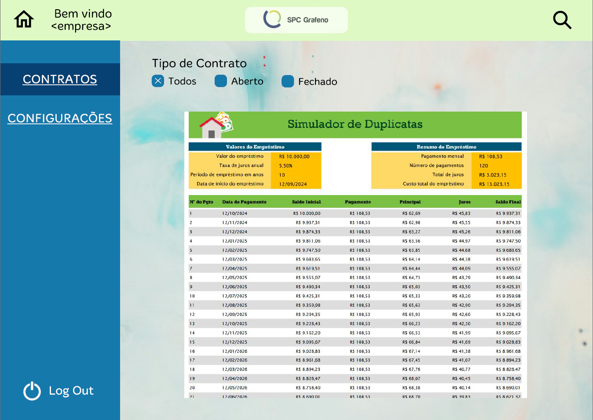

# API 6th Semester - Quarks Team
### [ PT/BR README: ](https://github.com/quarks-team/Projeto-Integrador-SPCGrafeno/blob/main/Documents/PTBR/README_PT.md) 
 

## Repository Overview

This repository contains the manual and other resources related to the 2024-2 Integrador Project.

### Context

We have been engaged by SPC Grafeno, a financial asset register, to develop innovative financial products leveraging machine learning techniques. The company has provided us with a diverse dataset containing historical information on various financial assets, transactions, and market behaviors.

### Challenge

Our challenge is to explore this extensive database, identify patterns and opportunities, and create one or more financial products that provide value to both SPC Grafeno and its clients. 

We are expected to employ machine learning techniques to:
- Predict market trends
- Identify risks
- Propose methods for asset evaluation

The solution should culminate in a proof of concept that demonstrates the feasibility of the proposed product. This will include:
- A detailed description of the model used
- Justification for the selected techniques
- A performance evaluation of the model

At the end of the project, we will present our findings in a report, complemented by a presentation that clearly outlines how our solution can be utilized by SPC Grafeno and the benefits it can offer to the registry and its clients.

### Proposed Solution

We propose developing a system that analyzes the reliability of endorsers using AI algorithms and models. This system will generate a score that reflects how well a company upholds its credit commitments. Given that possessing an invoice typically guarantees that the amount contracted in advance will be paid, our solution aims to enhance the evaluation process for both the company and its clients.

## Requirements

### Functional Requirements
1. **AI Score Generation**: Develop an AI system that generates a credit score based on the endorser's historical data.
2. **Web Platform**: Create a web platform that displays the score for endorser users and their historical data.
3. **Consent Mechanism**: Implement a consent mechanism where users can agree to or revoke the use of their data in accordance with LGPD.
4. **Duplicate Completion Prediction**: Use AI to predict the probability of a contract being finalized based on user data.
5. **Real-Time Score Feedback**: Allow clients to input their data and see how it impacts their score in real time.
6. **Target Score Adjustment**: Provide a mechanism for clients to enter a target score and receive suggestions on what changes are needed to achieve it.
7. **Data Access**: SPC users will have access to all user data that consented to data usage, while endorser users can only access their own data.

### Non-Functional Requirements
1. **Compliance**: Ensure the system complies with the General Data Protection Law (LGPD).
2. **Security**: Implement secure authentication and authorization processes to protect user data.
3. **Usability**: Design an intuitive user interface for the web platform that facilitates easy navigation and data access.
4. **Performance**: Ensure that the AI models provide timely responses for real-time feedback.
5. **Scalability**: Design the system to handle increased loads as the number of users grows.
6. **Documentation**: Provide comprehensive documentation for both users and developers.

## Backlog

<h3>Functional Requirements</h3>
<table border="1">
    <thead>
        <tr>
            <th>ID</th>
            <th>Story</th>
            <th>Description</th>
            <th>Priority</th>
            <th>Functional Requirements Met</th>
        </tr>
    </thead>
    <tbody>
        <tr>
            <td>1</td>
            <td><a href="https://github.com/quarks-team/Projeto-Integrador-SPCGrafeno/blob/main/Documents/userStorys/ENUs/loginAutenticacaoEndorser.md" target='_blank'> Endorser Login/Authentication </a></td>
            <td>As an endorser user, I want to authenticate on the platform using my CNPJ and password, so I can access my account and view my score, provided I have accepted the terms.</td>
            <td>High</td>
            <td>AI Score Generation, Web Platform</td>
        </tr>
        <tr>
            <td>2</td>
            <td><a href="https://github.com/quarks-team/Projeto-Integrador-SPCGrafeno/blob/main/Documents/userStorys/ENUs/transformacaoDosDadosParaIA.md" target='_blank'> Data Transformation for AI </a></td>
            <td>As a data engineer, I want to transform and clean data according to predefined rules, so unnecessary data is removed and the cleaned data is accessible for testing AI algorithms.</td>
            <td>High</td>
            <td>Data Access, Data Cleaning and Preprocessing</td>
        </tr>
        <tr>
            <td>3</td>
            <td><a href="https://github.com/quarks-team/Projeto-Integrador-SPCGrafeno/blob/main/Documents/userStorys/ENUs/ModeloIAVisandoScore.md" target='_blank'> AI Model for Score </a></td>
            <td>As a data scientist, I want to test various AI algorithms that generate a credit score for each endorser, so I can evaluate their reliability in fulfilling credit obligations.</td>
            <td>High</td>
            <td>AI Score Generation, Real-Time Score Feedback</td>
        </tr>
        <tr>
            <td>4</td>
            <td><a href="https://github.com/quarks-team/Projeto-Integrador-SPCGrafeno/blob/main/Documents/userStorys/ENUs/preverFinalizacaoDeFaturas.md" target='_blank'> AI Model for Duplicate Prediction </a></td>
            <td>As a data scientist, I want to test various AI algorithms that generate a duplicate status prediction, so I can evaluate the reliability in fulfilling credit obligations.</td>
            <td>High</td>
            <td>Duplicate Completion Prediction</td>
        </tr>
        <tr>
            <td>5</td>
            <td><a href="https://github.com/quarks-team/Projeto-Integrador-SPCGrafeno/blob/main/Documents/userStorys/ENUs/configuracaoConsentimentoEndorser.md" target='_blank'> Consent Configuration - Endorser </a></td>
            <td>As an endorser user, I want to configure my consent regarding terms and policies, so I can manage how my data is used on the platform.</td>
            <td>High</td>
            <td>Compliance, Usability</td>
        </tr>
        <tr>
            <td>6</td>
            <td><a href="https://github.com/quarks-team/Projeto-Integrador-SPCGrafeno/blob/main/Documents/userStorys/ENUs/PrevisaoDeFinalizacaoDeDuplicatasSPC.md" target='_blank'> Duplicate Completion Prediction - SPC </a></td>
            <td>As an SPC user, I want to predict the completion of a duplicate based on provided parameters, so I can understand the likelihood of a specific duplicate being finalized.</td>
            <td>Medium</td>
            <td>Duplicate Completion Prediction</td>
        </tr>
        <tr>
            <td>7</td>
            <td><a href="https://github.com/quarks-team/Projeto-Integrador-SPCGrafeno/blob/main/Documents/userStorys/ENUs/PrevisaoScoreSPC.md" target='_blank'> Score Prediction - SPC </a></td>
            <td>As an SPC user, I want to predict the score of an endorser based on parameters that I will input, so I can understand how changes in parameters affect the user's credit score.</td>
            <td>Medium</td>
            <td>Real-Time Score Feedback</td>
        </tr>
        <tr>
            <td>8</td>
            <td><a href="https://github.com/quarks-team/Projeto-Integrador-SPCGrafeno/blob/main/Documents/userStorys/ENUs/previsaoScoreAlvoEndorser.md" target='_blank'> Target Score Prediction - Endorser </a></td>
            <td>As an endorser user, I want to discover what changes are necessary to achieve a target score that I will provide, so I can make informed decisions and improve my credit situation.</td>
            <td>Medium</td>
            <td>Target Score Adjustment</td>
        </tr>
        <tr>
            <td>9</td>
            <td><a href="https://github.com/quarks-team/Projeto-Integrador-SPCGrafeno/blob/main/Documents/userStorys/ENUs/OtimizacaodeModelosIA.md" target='_blank'> Optimization of AI Models </a></td>
            <td>As a data scientist, I want to optimize the selected AI models, so I can achieve greater accuracy in predicting credit scores and invoice completion.</td>
            <td>Low</td>
            <td>AI Score Generation</td>
        </tr>
        <tr>
            <td>10</td>
            <td><a href="https://github.com/quarks-team/Projeto-Integrador-SPCGrafeno/blob/main/Documents/userStorys/ENUs/dashboardAnaliseCnpjsScore.md" target='_blank'> Dashboard for CNPJ Score Analysis </a></td>
            <td>As a financial analyst, I want to visualize a dashboard that shows the evolution of credit scores for each CNPJ, so I can understand the key metrics that impact these scores.</td>
            <td>Low</td>
            <td>Web Platform</td>
        </tr>
    </tbody>
</table>

<h3>Non-Functional Requirements</h3>
<table border="1">
    <thead>
        <tr>
            <th>ID</th>
            <th>Story</th>
            <th>Description</th>
            <th>Priority</th>
            <th>Non-Functional Requirements Met</th>
        </tr>
    </thead>
    <tbody>
        <tr>
            <td>11</td>
            <td><a href="https://github.com/quarks-team/Projeto-Integrador-SPCGrafeno/blob/main/Documents/userStorys/ENUs/PipelineDeCIBackend.md" target='_blank'> CI Pipeline for Backend </a></td>
            <td>As a developer, I want to build a Continuous Integration (CI) pipeline for the backend repository, so unit and integration tests are automatically executed, ensuring code quality before merging to the main branch.</td>
            <td>High</td>
            <td>Documentation, Security</td>
        </tr>
        <tr>
            <td>12</td>
            <td><a href="https://github.com/quarks-team/Projeto-Integrador-SPCGrafeno/blob/main/Documents/userStorys/ENUs/CIPipelineForFrontend.md" target='_blank'> CI Pipeline for Frontend </a></td>
            <td>As a frontend developer, I want a CI pipeline for the frontend repository, so unit and integration tests are automatically executed to maintain development standards.</td>
            <td>High</td>
            <td>Documentation, Security</td>
        </tr>
        <tr>
            <td>13</td>
            <td><a href="https://github.com/quarks-team/Projeto-Integrador-SPCGrafeno/blob/main/Documents/userStorys/ENUs/ModeloIAVisandoScore.md" target='_blank'> AI Model for Score </a></td>
            <td>As a data scientist, I want to test various AI algorithms that generate a credit score for each endorser, so I can evaluate their reliability in fulfilling credit obligations.</td>
            <td>High</td>
            <td>Documentation, Performance</td>
        </tr>
        <tr>
            <td>14</td>
            <td><a href="https://github.com/quarks-team/Projeto-Integrador-SPCGrafeno/blob/main/Documents/userStorys/ENUs/PrivacyPolicy.md" target='_blank'> Privacy Policy </a></td>
            <td>As a user, I want to access the privacy policy of the application, so I understand how my data will be used and protected.</td>
            <td>Medium</td>
            <td>Compliance, Usability</td>
        </tr>
    </tbody>
</table>

  ## Sprint 1 Detailed Objective:

**Objective:**  
To develop and implement the foundational components of the AI model that generates credit scores based on CNPJ data, enabling users to effectively access and analyze their credit score values. This sprint aims to achieve the following specific goals:

1. **AI Model Development:**
   - Research and select multiple AI algorithms suitable for credit scoring based on CNPJ data.
   - Develop and test initial versions of the AI models to generate credit scores, ensuring that they accurately reflect the user's creditworthiness and commitment.

2. **User Access and Experience:**
   - Implement a secure and user-friendly login functionality for CNPJ users on the web platform, allowing them to authenticate and access their individual credit scores.
   - Design an intuitive interface that displays the user's credit score alongside relevant historical data, enhancing the user experience and promoting informed decision-making.

3. **Data Transformation and Storage:**
   - Clean and preprocess the necessary data to ensure its quality and reliability for AI model testing.
   - Transform and store this data in the database, making it accessible for the AI model, while also maintaining data integrity and compliance with relevant regulations.

4. **Testing and Validation:**
   - Conduct thorough testing of both the AI models and the web platform functionalities to identify and resolve any issues before deployment.
   - Gather user feedback during testing to refine the AI scoring process and the user interface, ensuring alignment with user expectations and requirements.

5. **Documentation and Knowledge Transfer:**
   - Document the processes, algorithms, and methodologies used in developing the AI model for future reference and scalability.
   - Prepare training materials and sessions for team members and stakeholders to facilitate understanding and support for the new features introduced in this sprint.

By the end of Sprint 1, users should be able to log in to the web platform, view their credit scores generated by the AI model, and access historical data relevant to their credit endorsements, paving the way for more advanced analytics and insights in subsequent sprints.

## Backlog Sprint 1:

<h3>Functional Requirements</h3>
<table border="1">
    <thead>
        <tr>
            <th>ID</th>
            <th>Story</th>
            <th>Description</th>
            <th>Priority</th>
        </tr>
    </thead>
    <tbody>
        <tr>
            <td>1</td>
            <td><a href="https://github.com/quarks-team/Projeto-Integrador-SPCGrafeno/blob/main/Documents/userStorys/ENUs/loginAutenticacaoEndorser.md" target='_blank'> Endorser Login/Authentication </a></td>
            <td>As an endorser user, I want to authenticate on the platform using my CNPJ and password, so I can access my account and view my score, provided I have accepted the terms.</td>
            <td>High</td>
        </tr>
        <tr>
            <td>3</td>
            <td><a href="https://github.com/quarks-team/Projeto-Integrador-SPCGrafeno/blob/main/Documents/userStorys/ENUs/ModeloIAVisandoScore.md" target='_blank'> AI Model for Score </a></td>
            <td>As a data scientist, I want to test various AI algorithms that generate a credit score for each endorser, so I can evaluate their reliability in fulfilling credit obligations.</td>
            <td>High</td>
        </tr>
        <tr>
            <td>2</td>
            <td><a href="https://github.com/quarks-team/Projeto-Integrador-SPCGrafeno/blob/main/Documents/userStorys/ENUs/transformacaoDosDadosParaIA.md" target='_blank'> Data Transformation for AI </a></td>
            <td>As a data engineer, I want to transform and clean data according to predefined rules, so unnecessary data is removed and the cleaned data is accessible for testing AI algorithms.</td>
            <td>High</td>
        </tr>
        <tr>
            <td>5</td>
            <td><a href="https://github.com/quarks-team/Projeto-Integrador-SPCGrafeno/blob/main/Documents/userStorys/ENUs/configuracaoConsentimentoEndorser.md" target='_blank'> Consent Configuration - Endorser </a></td>
            <td>As an endorser user, I want to configure my consent regarding terms and policies, so I can manage how my data is used on the platform.</td>
            <td>High</td>
        </tr>
    </tbody>
</table>

## Wireframe Sprint 1:

    
Show Wireframes

        <h2>Login Page</h2>
        
        <h2>Home Page</h2>
        
        <h2>Bills Table Page</h2>
        

<h3><a href = "https://github.com/quarks-team/Projeto-Integrador-SPCGrafeno/blob/main/Documents/README.md" target='_blank'> Tutorial to build application: </a></h3

## Final App Sprint 1:

    
Show Application

    <h2>Login Endorser Medium Score</h2>
    
    <h2>Login Endorser Low Score</h2>
    

## Sprint 2 Objective

This sprint aims to develop AI-based solutions to predict the finalization of duplicates. Additionally, it will focus on implementing a consent mechanism in compliance with the LGPD and improving the AI score model.

### Key Goals:

- **Duplicate Finalization Prediction:** Create an AI model to analyze user inputs and predict whether a duplicate will be finalized, enabling informed decision-making.

- **Improvement of AI Score Model:** Enhance the existing AI score model to increase accuracy and reliability in predicting user credit scores.

- **Completion of LGPD-Compliant Consent Mechanism:** Finalize the consent system to give users clear control over their personal data and ensure legal compliance.

### Expected Impact:

Effective predictions will enable users to make informed financial decisions, enhancing asset management. The consent mechanism will ensure legal compliance and build user trust in the platform.

### Sprint Outcome:

At the end of the sprint, we expect to deliver a functional AI model, an intuitive user interface for duplicate predictions, and a robust consent system fully compliant with legal requirements.

## Sprint 2 Backlog:

<h3>Functional Requirements</h3> <table border="1"> <thead> <tr> <th>ID</th> <th>Story</th> <th>Description</th> <th>Priority</th> <th>Functional Requirements Met</th> </tr> </thead> <tbody> <tr> <td>1</td> <td><a href="https://github.com/quarks-team/Projeto-Integrador-SPCGrafeno/blob/main/Documents/userStorys/ENUs/PipelineDeCIBackend.md" target="_blank"> CI Pipeline for Backend </a></td> <td>As a backend developer, I want to build a Continuous Integration (CI) pipeline for the backend repository, so that unit and integration tests are automatically executed, ensuring code quality before merging into the main branch.</td> <td>High</td> <td>Thorough Testing</td> </tr> <tr> <td>2</td> <td><a href="https://github.com/quarks-team/Projeto-Integrador-SPCGrafeno/blob/main/Documents/userStorys/ENUs/CIPipelineForFrontend.md" target="_blank"> CI Pipeline for Frontend </a></td> <td>As a frontend developer, I want a CI pipeline for the frontend repository, so that unit and integration tests are automatically executed to maintain development standards.</td> <td>High</td> <td>Thorough Testing</td> </tr> <tr> <td>3</td> <td><a href="https://github.com/quarks-team/Projeto-Integrador-SPCGrafeno/blob/main/Documents/userStorys/ENUs/transformacaoDosDadosParaIA.md" target="_blank"> Data Transformation for AI </a></td> <td>As a data engineer, I want to transform and clean data according to predefined rules, so unnecessary data is removed and the cleaned data is accessible for testing AI algorithms.</td> <td>High</td> <td>Data Cleaning and Preprocessing, Data Storage</td> </tr> <tr> <td>4</td> <td><a href="https://github.com/quarks-team/Projeto-Integrador-SPCGrafeno/blob/main/Documents/userStorys/ENUs/ModeloIAVisandoScore.md" target="_blank"> AI Model for Score </a></td> <td>As a data scientist, I want to test various AI algorithms that generate a credit score for each endorser, so I can evaluate their reliability in fulfilling credit obligations.</td> <td>High</td> <td>Research AI Algorithms, Develop Initial AI Models, Thorough Testing</td> </tr> <tr> <td>5</td> <td><a href="https://github.com/quarks-team/Projeto-Integrador-SPCGrafeno/blob/main/Documents/userStorys/ENUs/PrevisaoDeFinalizacaoDeDuplicatasSPC.md" target="_blank"> Duplicate Completion Prediction - SPC </a></td> <td>As an SPC user, I want to predict the finalization of a duplicate based on provided parameters, so that I can understand the likelihood of a specific duplicate being finalized or not.</td> <td>High</td> <td>Predict Duplicate Finalization</td> </tr> <tr> <td>6</td> <td><a href="https://github.com/quarks-team/Projeto-Integrador-SPCGrafeno/blob/main/Documents/userStorys/ENUs/OtimizacaodeModelosIA.md" target="_blank"> Optimization of AI Models </a></td> <td>As a data scientist, I want to optimize selected AI models, so that I can achieve higher accuracy in predicting credit scores and invoice finalizations.</td> <td>High</td> <td>Improve AI Score Model</td> </tr> <tr> <td>7</td> <td><a href="https://github.com/quarks-team/Projeto-Integrador-SPCGrafeno/blob/main/Documents/userStorys/ENUs/preverFinalizacaoDeFaturas.md" target="_blank"> AI Model for Duplicate Prediction </a></td> <td>As a data scientist, I want to develop an AI model to predict whether an invoice will be finalized, so that I can help the finance team identify invoices with a high probability of finalization.</td> <td>Medium</td> <td>Predict Duplicate Finalization</td> </tr> </tbody> </table> <h3>Non-Functional Requirements</h3> <table border="1"> <thead> <tr> <th>ID</th> <th>Story</th> <th>Description</th> <th>Priority</th> <th>Non-Functional Requirements Met</th> </tr> </thead> <tbody> <tr> <td>8</td> <td><a href="https://github.com/quarks-team/Projeto-Integrador-SPCGrafeno/blob/main/Documents/userStorys/ENUs/PipelineDeCIBackend.md" target="_blank"> CI Pipeline for Backend </a></td> <td>As a backend developer, I want to build a Continuous Integration (CI) pipeline for the backend repository, so that unit and integration tests are automatically executed, ensuring code quality before merging into the main branch.</td> <td>High</td> <td>Documentation, Security</td> </tr> <tr> <td>9</td> <td><a href="https://github.com/quarks-team/Projeto-Integrador-SPCGrafeno/blob/main/Documents/userStorys/ENUs/CIPipelineForFrontend.md" target="_blank"> CI Pipeline for Frontend </a></td> <td>As a frontend developer, I want a CI pipeline for the frontend repository, so that unit and integration tests are automatically executed to maintain development standards.</td> <td>High</td> <td>Documentation, Security</td> </tr> </tbody> </table>

### Used Technologies
- [Typescript](https://www.typescriptlang.org/)
- [Node.js](https://nodejs.org/en)
- [PostgreSql](https://https://www.postgresql.org/)
- [Vue.js](https://vuejs.org/)
- [Python](https://www.python.org/)
- [Railway](https://railway.app/)
- [Docker/Docker Compose](https://www.docker.com/)
  

  

## Schedule:

| Event             | Date           |
| ----------------- | -------------- |
| Kick-off          | 02/09 to 08/09 |
| Sprint 1          | 09/09 to 29/09 |
| Review            | 30/09 to 04/10 |
| Sprint 2          | 07/10 to 27/10 |
| Review            | 28/10 to 01/11 |
| Sprint 3          | 04/11 to 24/11 |
| Review            | 25/11 to 11/12 |
| Feira de Soluções | 12/12          |

(<a href="#top">Scroll to top</a>)

## Team

| Avatar                                                     | Student               | Function         | GitHub                                                              | LinkedIn                                                                           |
| ---------------------------------------------------------- | --------------------- | ---------------- | ---------------------------------------------------------------------- | --------------------------------------------------------------------------------- |
|     | **Daniela Meirelles** | _Scrum Master_ |      |                                                    
|    | **Leonardo Adler**    | _Product Owner_ |            |                                                    
|      | **Felipe Augusto**    | _Developer Team_   |      | 
|     | **Gabriel Timoteo**   | _Developer Team_  |  |                                                  
|  | **Guilherme Alves**   | _Developer Team_ |       | |
|       | **Lucas Barcelos**    | _Developer Team_ |      |                                                    
|    | **Nicolas Cursino**   | _Developer Team_ |           | 

(<a href="#top">Scroll to top</a>)

## Documentation
- [Commit Pattern](https://github.com/quarks-team/Projeto-Integrador-SPCGrafeno/wiki/Commit-Pattern)
- [Documentation of Consent Processes](https://github.com/quarks-team/Projeto-Integrador-SPCGrafeno/wiki/Documentation-of-Consent-Processes)
- [Weight Rules for the AI Score](https://github.com/quarks-team/Projeto-Integrador-SPCGrafeno/wiki/AI-Score-Weight-Rules-Documentation)

## License
This project was created under the MIT license - look the file [LICENSE](LICENSE) for more details.
